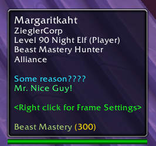

[](https://github.com/Limmek/PersonalPlayerNotes/actions/workflows/ci.yml)
[](https://github.com/Limmek/PersonalPlayerNotes/actions/workflows/interface-version.yml)
[](https://github.com/Limmek/PersonalPlayerNotes/actions/workflows/release.yml)
[](LICENSE)

# Personal Player Notes

**Remember who they are.**

Tag players with personal notes and color-coded reasons so you always know who you're dealing with. Notes and reasons appear directly in their tooltip, with an optional sound alert the next time you run into them.

**Download**: [CurseForge](https://www.curseforge.com/wow/addons/personal-player-notes) · [GitHub Releases](https://github.com/Limmek/PersonalPlayerNotes/releases)



*Hovering a listed player shows your note and reason directly in their tooltip.*

## Features

- **Notes** — write a free-text note on any player
- **Reasons** — define reusable, color-coded categories (e.g. "Great healer", "Ninja looter")
- **Tooltip integration** — note and reason are shown the moment you hover over a listed player
- **Alert sounds** — play a sound when you encounter a listed player, either once per session or repeating after a configurable cooldown
- **Custom sounds** — add your own sound files, configurable globally, per reason, or per player
- **Per-player overrides** — a player's own settings take priority over their reason's, which take priority over the global default
- **Profiles** — per-character or shared profiles via Ace3's standard profile management (copy, reset, delete)
- **Minimap button** — quick access to all settings and lists, with configurable click shortcuts, and can be hidden or repositioned
- **Context menu** — right-click any player (unit frame, chat link, etc.) to add or edit a note instantly
- **Local data** — everything stays in your WoW SavedVariables; nothing is sent externally

## Supported WoW clients

| Client | Version |
|--------|---------|
| Retail |  |
| Classic Era (incl. Hardcore, SoM, SoD) |  |
| Wrath Classic (CN/Titan servers) |  |
| Burning Crusade Classic (Anniversary) |  |
| Mists of Pandaria Classic |  |
| Cataclysm Classic | Retired by Blizzard — all realms moved to Mists of Pandaria Classic on 2025-07-01 |

## Installation

### Via addon manager (recommended)

Install through the [CurseForge App](https://www.curseforge.com/download/app) or [WowUp](https://wowup.io/) (or any other addon manager that supports CurseForge). Search for **Personal Player Notes** and click Install.

### Manual installation

1. Download the latest zip from [GitHub Releases](https://github.com/Limmek/PersonalPlayerNotes/releases) or [CurseForge](https://www.curseforge.com/wow/addons/personal-player-notes).
2. Extract the zip into your WoW `Interface/AddOns/` folder. The zip already contains the `PersonalPlayerNotes/` folder — after extraction it should look like:
   ```
   World of Warcraft/
   └── _retail_/          (or _classic_era_, _classic_, etc.)
       └── Interface/
           └── AddOns/
               └── PersonalPlayerNotes/
                   ├── PersonalPlayerNotes.toc
                   ├── PersonalPlayerNotes.lua
                   └── ...
   ```
3. Start or reload the game (`/reload`) and enable the addon on the character-select AddOns screen.

> **Migrating from the old Shitlist addon?** Keep Shitlist installed for one login after installing Personal Player Notes — it will offer to migrate your reasons and players automatically, after which Shitlist can safely be removed.

## Commands

| Command | Effect |
|---------|--------|
| `/ppn` | Open the Blizzard AddOns options page for this addon |
| `/ppno` or `/ppnoptions` | Open the general settings |
| `/ppnr` or `/ppnreasons` | Manage reasons (categories) |
| `/ppnp` or `/ppnplayers` | Manage listed players |
| `/ppnm` or `/ppnminimap` | Toggle the minimap button |
| `/ppndebug` | Toggle debug output |

## Minimap shortcuts

The minimap button also responds directly to clicks (hover it in-game for the same list):

| Click | Effect |
|-------|--------|
| Left-click | Open the general settings |
| Right-click | Open the Blizzard AddOns options page |
| Shift + Left-click | Manage reasons (categories) |
| Ctrl + Left-click | Manage listed players |

## Alert sounds

Personal Player Notes can play a sound whenever you encounter a listed player. Alerts can either fire once per player for the rest of the session, or repeat after a configurable cooldown (in seconds), and the sound itself resolves in priority order:

```
Player's own sound override
        ↓ (falls back to)
Player's reason's sound override
        ↓ (falls back to)
Global alert sound
```

Any of the three levels can use one of the built-in sounds, or your own custom `.mp3`/`.ogg` file dropped into this addon's `Sounds/` folder.

## Reasons

Reasons are reusable categories (e.g. "Great healer", "Ninja looter") that make your listed players easier to tell apart at a glance. Each reason has its own:

- Name and tooltip color
- Alert on/off toggle
- Alert sound override

Listed players can also override the sound of their reason (or the global default) individually.

## Profiles

Settings, reasons, and listed players are all stored per-profile via Ace3's standard profile system — use a separate profile per character, or share one profile across every character on your account. Profiles can be copied, reset, or deleted from the general settings.

## Data storage

All data is stored in the `PersonalPlayerNotesDB` SavedVariables file, which contains your reasons, player notes, and all settings. Nothing is sent externally.

## License

[MIT](LICENSE)

---

Contributing? See [.github/CONTRIBUTING.md](.github/CONTRIBUTING.md).

<p align="center"><strong>Personal Player Notes</strong> — Remember who they are.</p>
